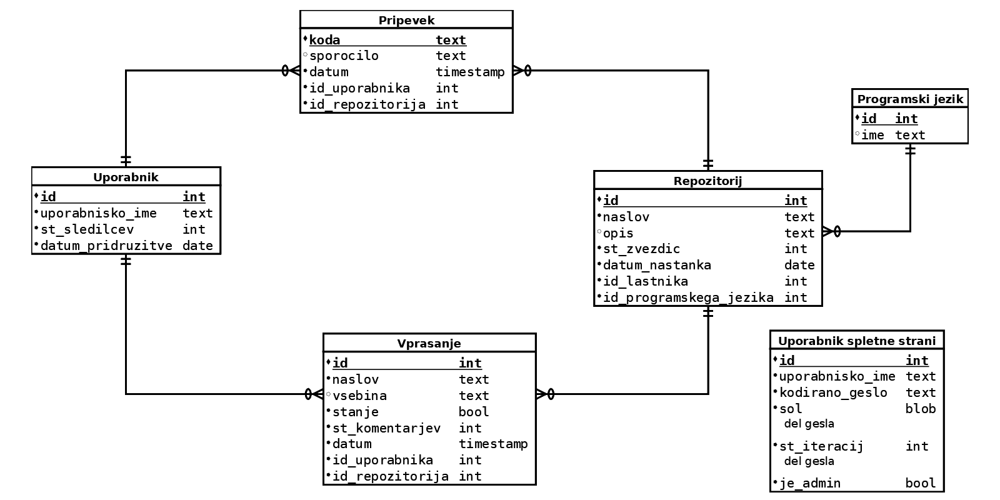

# GithubDB
Podatkovana baza, ki shranjuje podatke o repozitorijih 
na spletni strani [Github](https://github.com/). Repozitorij ima
več prispevkov in vprašanj, preko katerih osebe prispevajo k 
repozitoriju. Ti podatki so dostopni v tekstovnem ali spletnem
vmesniku.

Uporaba:
1. Kloniraj repozitorij

2. Iz korena repozitorija se premakni v mapo `src` (z ukazom `cd src`)

	2.1. **Vse sledeče operacije morajo biti izvedene v tej mapi!**

1. Zagotovi, da so nameščeni vsi spodnij Python moduli:
   * `os`
   * `csv`
   * `json`
   * `random`
   * `sqlite3`
   * `hashlib`
   * `bottle`
   * `requests`

2. (Nepotrebno) Zaženiti skripto `retrieve_data.py`

	4.1. Za pravilo delovanje ustvari datoteko `secret.py`(v mapi `src`), 
	ki vsebuje dve spremenljivki:
	* `secretUsername`, ki vsebuje github uporabniško ime,
	* `secretToken`, ki vsebuje pripadajoči github auth token.
  
	4.2. To je potrebno za komunikacijo z Github API-jem.

5. (Nepotrebno) Zaženi skripto `create_dbs.py`
   
6. Zaženi tekstovni(`text_interface.py`) ali spletni 
vmesnik(`web_interface.py`)
